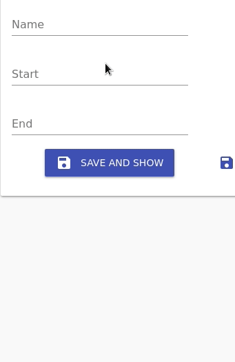

# React-Admin components for date display and input

Forked from unmaintained [react-admin-date-inputs](https://github.com/vascofg/react-admin-date-inputs)



## Installation

```bash
npm install @semapps/date-components --save
```

## Usage

```jsx
import React from 'react';
import { Edit, SimpleForm } from 'react-admin'
import { DateInput, TimeInput, DateTimeInput, DateRangeInput } from '@semapps/date-components';

export const MyEdit = (props) => (
  <Edit {...props}>
    <SimpleForm>
      <DateInput source="startDate" label="Start date" options={{ format: 'DD/MM/YYYY' }} />
      <TimeInput source="startTime" label="Start time" options={{ format: 'HH:mm:ss' }} />
      <DateTimeInput source="endDate" label="End time" options={{ format: 'DD/MM/YYYY, HH:mm:ss', ampm: false, clearable: true }} />
      <DateRangeInput sourceStart="startDate" sourceEnd="endDate" labelStart="Start date" labelEnd="End date"/>
    </SimpleForm>
  </Edit>
);

```

### Props

### `options`

The `options` prop is passed down to the pickers.

Documentation for these options can be found in the [material-ui-pickers documentation](https://material-ui-pickers.dev/) for the component you're trying to use.

### `providerOptions`

If you want to use a date adapter library other than `date-fns` or you want a locale other than english, you can pass the `providerOptions` prop:

```jsx
import DateFnsUtils from '@date-io/date-fns';
import MomentUtils from 'material-ui-pickers/utils/moment-utils';
import frLocale from "date-fns/locale/fr";
import moment from "moment";

<DateInput source="date" label="Date using moment" providerOptions={{ dateAdapter: MomentUtils, dateLibInstance: moment }} />
<DateInput source="date" label="Date in French!" providerOptions={{ dateAdapter: DateFnsUtils, locale: frLocale }} />
```

> Note: When specifying a locale you must also specify the `dateAdapter`, even if it's the default `DateFnsUtils`.


## Commands

### `npm run pre-publish`

Build the library in CommonJS and ES mode.
This command should always be run before publishing.

### `npm run dev`

Develop mode. Any change you make to a file in the `/src` directory will be immediately compiled.
