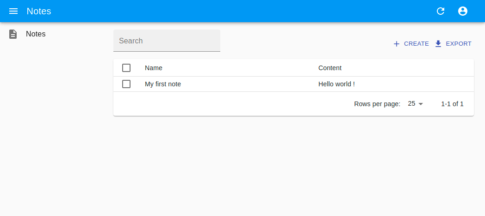

### Purpose

The SemApps project is primarily focused on the backend. You will need a frontend if you want to interact with the semantic data that are managed by the backend.

However, it is important for many projects to offer visibility on the data they manage, and thus we have provided tools to help you easily build a Data Management System (DMS).

The DMS you will create on this guide is based on [React-Admin](https://marmelab.com/react-admin/), a complete framework to build apps with React. Used by thousands of developers, it is easy to adapt to your needs.

In this guide, you will :
- **Create a DMS** using React-Admin;
- **Add/modify/delete data** using the DMS.

### Prerequisites

The only prerequisites is to have [NodeJS](https://nodejs.org/en/) installed on your computer (**use NodeJS version 14**).

You will of course also need a LDP server, configured with a SPARQL endpoint. Please see [this guide](ldp-server.md) if you didn't set it up yet.

## Create the DMS

### Setup the DMS

We provide a [custom template](https://create-react-app.dev/docs/custom-templates/) for Create-React-App to ease the creation of the DMS.

To use it, run this command:

```bash
npx create-react-app my-dms --template @semapps/dms
```

You can now go to the newly-created directory:

```bash
cd my-dms
```

### Launch the DMS

To launch the DMS, run the following command:

```bash
npm start
```

Your instance of the DMS is available at [http://localhost:5000](http://localhost:5000).

If you followed the previous guide until the end, you should see the Note that you POSTed:



### Configuration

By default, the DMS will look on port 3000 of your computer for the LDP server. You can change this by editing the `.env` file or by adding a `.env.local` file. You will also be able to change the port of the DMS:

```
REACT_APP_MIDDLEWARE_URL=http://localhost:3000/
PORT=5000
```

## Adding more resources

### Add and modify data

As we have done in the guide about the LDP server, you can try to add new notes, change their content, and try to remove them.

The [semantic data provider](../frontend/semantic-data-provider) will convert these operations to LDP or SPARQL queries. 
You can have a look at the Network tab in your browser console to see how this works behind the scene.

### Add more types of data

By default, the template is configured to have one type of resource, of the semantic type `as:Note`. 
You can change this by editing the `src/config/resources.js` file:

```
export default {
  Note: {
    types: ['as:Note'],
  }
};
```

The URL of the container is found by looking at the VoID endpoint that your newly-created LDP server provides. You can
see what it looks like by going to [http://localhost:3000/.well-known/void](http://localhost:3000/.well-known/void).

Try adding a React-Admin resource of type `as:Person` since it is also configured on your LDP server !

You will then need modify the `src/App.js` file which list the resources, define an edit form, etc. 
Please see the examples provided, and read the excellent [React-Admin documentation](https://marmelab.com/react-admin/Readme.html).
