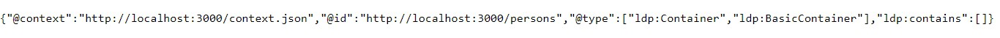
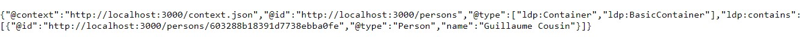

### Purpose

LDP means Linked Data Platform. It is a W3C Recommendation that defines a set of rules for HTTP operations on web resources to provide an architecture for read-write Linked Data on the web.

An LDP server is therefore useful for making HTTP requests to a semantic database (in which the Linked Data is stored) without operating directly on the database.

In this guide, you will :
- Create a **semapps instance** from a template using moleculer;
- Create a **Jena Fuseki instance** to store some data;
- **Add data** to your semantic data base **using your LDP server**.


### Prerequisites

You need to have [NodeJS](https://nodejs.org/en/) installed on your computer (**use NodeJS version 12**).

You also need [docker](https://docs.docker.com/install/) and [docker-compose](https://docs.docker.com/compose/install/) installed on your machine.

## Setup a new Moleculer project

### Moleculer

[Moleculer](https://moleculer.services/) is a back-end framework that facilitates the development of microservices that run by messages (and on different servers). It uses Node.js.

The [moleculer-cli](https://github.com/moleculerjs/moleculer-cli) tool is a command line tool that allows you to initialize new projects from templates for instance.

First, you need to install the moleculer-cli tool globally. 
To do so, open a terminal and runs the following command:

```bash
npm install -g moleculer-cli
```

Then, initialize a new project based on a semapps template with this command:

```bash
moleculer init assemblee-virtuelle/semapps-template-ldp my-project
```

Choose `yes` to all questions
```
? Do you need a local instance of Jena Fuseki (with Docker)? Yes
? Do you need a read-only SPARQL endpoint? Yes
Create 'my-project' folder...
? Would you like to run 'npm install'? Yes

Running 'npm install'...
```

You can now go to the newly-created directory:

```bash
cd my-project
```

### Launch your local Jena Fuseki instance

Jena Fuseki is a semantic triple store. It is where your app's data will be stored.

In the "my-project" directory, runs the following command :
```bash
docker-compose up
```

Jena Fuseki is now available at the URL http://localhost:3030.

Please login - By default the login is `admin` and the password is also `admin`.

Please start by create a new dataset and name it `localData` (case sensitive).
Your triples will be stored there.

You should get something like this:


### Run Moleculer in dev mode

Now that your semantic data base is ready, you can **launch you LDP server**, which has been created when you've initialized your semapps instance.

To do so, open an other terminal and run the following command in your my-project directory:

```bash
npm run dev
```

Your instance of SemApps is available at http://localhost:3000.

You should get something like this:


## Testing your LDP server

Now, it is time to test your LDP server, which means that you will try to update your data base by using this LDP server and not by using Jena Fuseki.

By default, the LDP service will create a LDP container in the `/persons` path. Indeed, if you go to http://localhost:3000/persons, you should see this LDP container:



### Add data with the LDP server

Now, let's try to add a person to our database. Post an ActivityStreams Note to this LDP container with a tool like [Insomnia](https://insomnia.rest/), [Postman](https://www.postman.com/downloads/) or the [RESTClient add-on for Firefox](https://addons.mozilla.org/fr/firefox/addon/restclient/).

```
POST /persons HTTP/1.1
Host: localhost:3000
Content-Type: application/json
Accept: */*
Content-Length: 97

{
 "@context": "https://www.w3.org/ns/activitystreams",
  "type": "Person",
  "name": "Guillaume Cousin"
}
```

Retrieve the `/persons` LDP container:

```
GET /persons HTTP/1.1
Host: localhost:3000
Accept: application/ld+json
```

You should get this result:

```json
{
  "@context": "http://localhost:3000/context.json",
  "@id": "http://localhost:3000/persons",
  "@type": [
    "ldp:Container",
    "ldp:BasicContainer"
  ],
  "ldp:contains": [
    {
      "@id": "http://localhost:3000/persons/603288b18391d7738ebba0fe",
      "@type": "Person",
      "name": "Guillaume Cousin"
    }
  ]
}
```
You should also see the result on http://localhost:3000/persons:



### Changes on Jena Fuseki

To test if our LDP server is really working, you should check if the data has been added to our Jena Fuseki instance.

Go to http://localhost:3030/dataset.html and make a SPARQL query to get all of your data. You should get the following result:


Guillaume Cousin has been added to the database : the LDP server works!