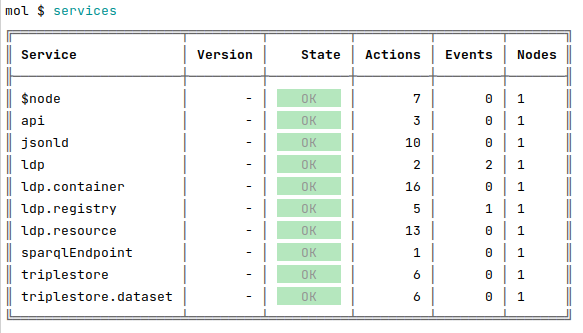

### Purpose

LDP means [Linked Data Platform](https://www.w3.org/TR/ldp-primer/). It is a W3C Recommendation that defines a set of rules for HTTP operations on web resources to provide an architecture for read-write Linked Data on the web.

An LDP server is therefore useful for making HTTP requests to a semantic database (in which the Linked Data is stored) without operating directly on the database.

In this guide, you will :
- Create a **SemApps instance** from a template using Moleculer;
- Create a **Jena Fuseki instance** to store some data;
- **Add data** to your semantic data base **using your LDP server**.


### Prerequisites

You need to have [NodeJS](https://nodejs.org/en/) installed on your computer (**use NodeJS version 12**).

You also need [Docker](https://docs.docker.com/install/) and [Docker-compose](https://docs.docker.com/compose/install/) installed on your machine.


## Initialize your LDP server

[Moleculer](https://moleculer.services/) is a framework that facilitates the development of microservices that run by messages (and on different servers). It uses Node.js.

The [moleculer-cli](https://github.com/moleculerjs/moleculer-cli) tool is a command line tool that allows you to initialize new Moleculer projects from templates.

First, you need to install the moleculer-cli tool globally. 
To do so, open a terminal and runs the following command:

```bash
npm install -g moleculer-cli
```

Then, initialize a new project based on a SemApps template with this command:

```bash
moleculer init assemblee-virtuelle/semapps-template-ldp my-project
```

Choose `yes` to all questions **except the one about WebACL authorizations**:
```
? Do you need a local instance of Jena Fuseki (with Docker)? Yes
? Do you need a read-only SPARQL endpoint? Yes
? Do you need WebACL (WAC) authorizations? No
Create 'my-project' folder...
? Would you like to run 'npm install'? Yes

Running 'npm install'...
```

You can now go to the newly-created directory:

```bash
cd my-project
```

### Launch your local Jena Fuseki instance

Jena Fuseki is a semantic triple store. It is where your app's data will be stored.

In the "my-project" directory, runs the following command :
```bash
docker-compose up
```

:::note
If you get this error message:
```
ERROR: Couldn't connect to Docker daemon at http+docker://localhost - is it running?
If it's at a non-standard location, specify the URL with the DOCKER_HOST environment variable.
```
Run the following command ([taken from here](https://stackoverflow.com/questions/34532696/docker-compose-cant-connect-to-docker-daemon)):
```
sudo chown $USER /var/run/docker.sock
```
:::

Jena Fuseki is now available at the URL [http://localhost:3030](http://localhost:3030).

By default the login is `admin` and the password is also `admin`.

There should be no dataset yet. It will be created when launching Moleculer.


### Run Moleculer in dev mode

Now that your triplestore is ready, you can **launch you LDP server**.

To do so, open another terminal and run the following command in your `my-project` directory:

```bash
npm run dev
```

Moleculer is in [REPL mode](https://moleculer.services/docs/0.14/moleculer-repl.html). 
Once it has finished starting, you can enter the command `services` to check the available services.



If you go to [http://localhost:3030](http://localhost:3030), you should see a `localData` dataset has been created.


Success ! Your LDP server is running correctly. Let's test it now.


## Testing your LDP server

Now, it is time to test your LDP server, which means that you will try to update your database by using this LDP server and not Jena Fuseki.

The LDP service created a LDP container in the `/notes` path. Indeed, if you go to [http://localhost:3000/notes](http://localhost:3000), you should see this empty LDP container:

```json
{ 
  "context": "http://localhost:3000/context.json",
  "id": "http://localhost:3000/users",
  "type": ["ldp:Container", "ldp:BasicContainer"],
  "ldp:contains": []
}
```

> We recommend to use an extension like [JSONView](https://jsonview.com/) to your browser to see pretty-formatted JSON.


### Add data to the LDP server

Now, let's try to add some data to our container. Post an ActivityStreams Note with a tool like [Insomnia](https://insomnia.rest/), [Postman](https://www.postman.com/downloads/) or the [RESTClient add-on for Firefox](https://addons.mozilla.org/fr/firefox/addon/restclient/).

```
POST /notes HTTP/1.1
Host: localhost:3000
Content-Type: application/json
Accept: */*
Content-Length: 97
{
  "@context": "https://www.w3.org/ns/activitystreams",
  "type": "Note",
  "content": "Hello world !"
}
```

Retrieve the `/notes` LDP container:

```
GET /notes HTTP/1.1
Host: localhost:3000
Accept: application/ld+json
```

You should get this result:

```json
{
  "context": "http://localhost:3000/context.json",
  "id": "http://localhost:3000/notes",
  "type": ["ldp:Container", "ldp:BasicContainer"],
  "ldp:contains": [
    {
      "id": "http://localhost:3000/notes/603288b18391d7738ebba0fe",
      "type": "Note",
      "content": "Hello world !"
    }
  ]
}
```


### Verify changes on Jena Fuseki

To test if our LDP server is really working, you should check if the data has been added to our Jena Fuseki instance.

Go to [http://localhost:3030/dataset.html](http://localhost:3030/dataset.html) and make a SPARQL query to get all of your data.

```
SELECT ?subject ?predicate ?object
WHERE {
  ?subject ?predicate ?object
}
```

You should get the following result:


Your first note has been added to the database : the LDP server works!
